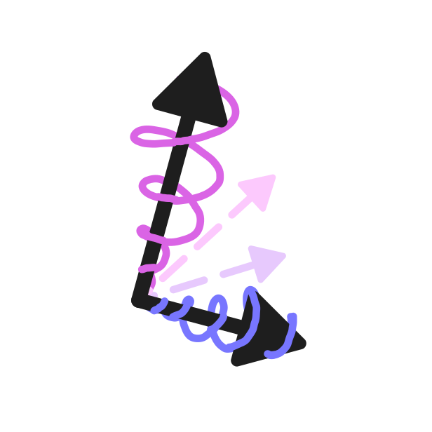

# LUCID

_Learning-Enabled Uncertainty-Aware Certification of Stochastic Dynamical Systems_

[](https://github.com/TendTo/lucid/actions/workflows/lucid.yml)
[](https://github.com/TendTo/lucid/actions/workflows/pylucid.yml)
[](https://github.com/TendTo/lucid/actions/workflows/docker.yml)
[](https://github.com/TendTo/lucid/actions/workflows/docs.yml)

<div style="display: none">
<!-- Necessary to load the image in the Doxygen output folder. Do not remove! -->

</div>

> My integral is your table.  
> -- _[Oliver Schön](https://oliverschon.com/)_

## Quick installation

For more details, see the [installation instructions](docs/Installation.md).

[//]: # "@tabbed"
[//]: # "@tab"

### Docker (pre-built)

**Requirements**

- [Docker](https://www.docker.com/)
- [Gurobi Web License Service (WLS) license](https://www.gurobi.com/features/web-license-service/)

**Command**

```bash
# Pull the image
docker pull ghcr.io/tendto/lucid:main

# Run the image on script/path/to/script.py.
# Needs the Gurobi WS licence /path/to/gurobi.lic
docker run --name lucid -it --rm \
  -v/path/to/script.py:/scripts \
  -v/path/to/gurobi.lic:/opt/gurobi/gurobi.lic:ro \
  ghcr.io/tendto/lucid:main /scripts/script.py
```

[//]: # "@end-tab"
[//]: # "@tab"

### Docker (source)

**Requirements**

- [Docker](https://www.docker.com/)
- [Gurobi Web License Service (WLS) license](https://www.gurobi.com/features/web-license-service/)

**Command**

```bash
# Build the image
docker build -t lucid .

# Run the image on script/path/to/script.py.
# Needs the Gurobi WS licence /path/to/gurobi.lic
docker run --name lucid -it --rm \
  -v/path/to/script.py:/scripts \
  -v/path/to/gurobi.lic:/opt/gurobi/gurobi.lic:ro \
  lucid /scripts/script.py
```

[//]: # "@end-tab"
[//]: # "@tab"

### Python (pre-built)

**Requirements**

- [Python](https://www.python.org/) 3.8 or higher
- [Linux, Glibc >= 2.35](https://gist.github.com/richardlau/6a01d7829cc33ddab35269dacc127680), [Windows](https://www.microsoft.com/windows) or [ARM macOS](https://www.apple.com/macos/) operating system
- [Gurobi](https://www.gurobi.com/) 12.0.0 or higher

> [!WARNING]  
> The pre-built Python package expects to find the _Gurobi Optimizer >= 12.0_ installed on your system.
> You can freely download it from the [Gurobi website](https://www.gurobi.com/downloads/) (a login may be required).
> You **do not need** to have a valid license if you don't plan to use the Gurobi solver.

**Installation commands**

```bash
# Create a virtual environment (optional)
python3 -m venv .venv

# Activate the virtual environment on Linux (optional)
source .venv/bin/activate

# Activate the virtual environment on Windows (optional)
.venv\Scripts\activate

# Install the python wrapper (pylucid)
pip install pylucid --index-url https://gitlab.com/api/v4/projects/71977529/packages/pypi/simple

# Ensure pylucid is installed
python3 -c "import pylucid; print(pylucid.__version__)"
```

[//]: # "@end-tab"
[//]: # "@tab"

### Python (from source)

**Requirements**

- [Bazel](https://bazel.build/) 8.1.1
- [Python](https://www.python.org/) 3.8 or higher
- C++ compiler with C++20 support
  - **On Linux**: [gcc](https://gcc.gnu.org/) 11.4.0
  - **On Windows**: [msvc](https://visualstudio.microsoft.com/) 19.32.31332
  - **On macOS**: [Clang/LLVM](https://clang.llvm.org/) 15.0.0
- [Gurobi](https://www.gurobi.com/) 12.0.0 or higher

**Installation commands**

```bash
# Clone the repository
git clone https://github.com/TendTo/lucid.git

# Move to the root of the repository
cd lucid

# Create a virtual environment (optional)
python3 -m venv .venv

# Activate the virtual environment on Linux (optional)
source .venv/bin/activate

# Activate the virtual environment on Windows (optional)
.venv\Scripts\activate

# Install the python wrapper (pylucid)
pip install .

# Ensure pylucid is installed
python3 -c "import pylucid; print(pylucid.__version__)"
```

[//]: # "@end-tab"
[//]: # "@tab"

### Source

**Requirements**

- [Bazel](https://bazel.build/) 8.1.1
- C++ compiler with C++20 support
  - **On Linux**: [gcc](https://gcc.gnu.org/) 11.4.0
  - **On Windows**: [msvc](https://visualstudio.microsoft.com/) 19.32.31332
  - **On macOS**: [Clang/LLVM](https://clang.llvm.org/) 15.0.0
- [Gurobi](https://www.gurobi.com/) 12.0.1

> [!IMPORTANT]  
> While it is possible to run the Lucid binary following the instructions below,
> right now it simply solves a default problem.

**Installation commands**

```bash
# Clone the repository
git clone https://github.com/TendTo/lucid.git

# Move to the root of the repository
cd lucid

# Compile and run lucid
bazel run //lucid -- [args]
```

[//]: # "@end-tab"
[//]: # "@end-tabbed"
