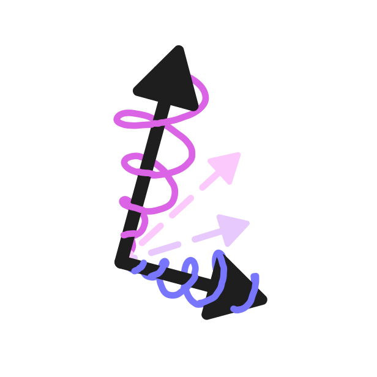

#  LUCID

_Learning-Enabled Uncertainty-Aware Certification of Stochastic Dynamical Systems_

[](https://github.com/TendTo/lucid/actions/workflows/lucid.yml)
[](https://github.com/TendTo/lucid/actions/workflows/pylucid.yml)
[](https://github.com/TendTo/lucid/actions/workflows/docker.yml)
[](https://github.com/TendTo/lucid/actions/workflows/docs.yml)

> [!TIP]  
> Try out the [online demo](https://tendto.github.io/lucid/demo/)!
> Note that the memory in the browser is limited, so only small problems can be solved.

> [!WARNING]  
> This project is under active development.
> Features and APIs may change without prior notice.
> Please refer to the [changelog](docs/Changelog.md) for the latest updates.

## Quick installation

For more details, see the [installation](docs/Installation.md) or the [Pylucid](docs/Pylucid.md) sections.
If you encounter any errors, please refer to the [Troubleshooting](docs/FAQ.md#troubleshooting) section or open an [issue](https://github.com/TendTo/lucid/issues).

[//]: # "@tabbed"
[//]: # "@tab"

### Docker (pre-built)

Fully fledged Docker image available on the GitHub repository's [container registry](https://github.com/orgs/TendTo/packages/container/package/lucid).

**Requirements**

- [Docker](https://www.docker.com/)
- (_Optional_) [Gurobi Web License Service (WLS) license](https://www.gurobi.com/features/web-license-service/)

**Command**

```bash
# Pull the image
docker pull ghcr.io/tendto/lucid:main

# Run the image on script/path/to/script.py.
# Needs a Gurobi WS licence to use the Gurobi solver.
docker run --name lucid -it --rm \
  -v/path/to/script.py:/scripts \
  -v/path/to/gurobi.lic:/opt/gurobi/gurobi.lic:ro \
  ghcr.io/tendto/lucid:main /scripts/script.py

# Run the GUI.
# Needs a Gurobi WS licence to use the Gurobi solver.
docker run --name lucid -it --rm -p 3661:3661 \
  -v/path/to/gurobi.lic:/opt/gurobi/gurobi.lic:ro \
  --entrypoint pylucid-gui ghcr.io/tendto/lucid:main
```

[//]: # "@end-tab"
[//]: # "@tab"

### Docker (source)

Fully fledged Docker image that you can build from source.
Useful if you want to apply custom modifications to the codebase or if you want to use a specific commit as a base.
Intended for advanced users.

**Requirements**

- [Docker](https://www.docker.com/)
- (_Optional_) [Gurobi Web License Service (WLS) license](https://www.gurobi.com/features/web-license-service/)

**Command**

```bash
# Build the image
docker build -t lucid .

# Run the image on /path/to/script.py.
# You will need a Gurobi WS licence to use the Gurobi solver.
docker run --name lucid -it --rm \
  -v/path/to/script.py:/scripts \
  -v/path/to/gurobi.lic:/opt/gurobi/gurobi.lic:ro \
  lucid /scripts/script.py

# Run the GUI.
# You will need a Gurobi WS licence to use the Gurobi solver.
docker run --name lucid -it --rm -p 3661:3661 \
  -v/path/to/gurobi.lic:/opt/gurobi/gurobi.lic:ro \
  --entrypoint pylucid-gui lucid
```

[//]: # "@end-tab"
[//]: # "@tab"

### Docker (light)

Lightweight Docker image available on the GitHub repository's [container registry](https://github.com/orgs/TendTo/packages/container/package/lucid-light).
This image does not support the Gurobi solver, relaying instead on open-source solvers only (e.g., HiGHS).
Moreover, it does not include the Python wrapper `pylucid`, so it can only parse `.yaml` configuration files.
As a result, it has a significantly smaller footprint (~70MB).

**Requirements**

- [Docker](https://www.docker.com/)

**Command**

```bash
# Run the image on /path/to/config.yaml.
docker run --name lucid -it --rm \
  -v/path/to/config.yaml:/config.yaml \
  ghcr.io/tendto/lucid-light:main /config.yaml
```

[//]: # "@end-tab"
[//]: # "@tab"

### Python (pre-built)

**Requirements**

- [Python](https://www.python.org/) 3.8 or higher
- [Linux, Glibc >= 2.35](https://gist.github.com/richardlau/6a01d7829cc33ddab35269dacc127680), [Windows](https://www.microsoft.com/windows) or [ARM macOS](https://www.apple.com/macos/) operating system
- (_Optional_) [Gurobi licence](https://www.gurobi.com/)

**Installation commands**

```bash
# Create a virtual environment - Linux (optional)
python3 -m venv .venv ; source .venv/bin/activate

# Create a virtual environment - Windows (optional)
python3 -m venv .venv ; .venv\Scripts\activate

# Install pylucid (with GUI and Gurobi support, optional)
pip install "pylucid[gui,gurobi]" --index-url "https://gitlab.com/api/v4/projects/71977529/packages/pypi/simple"

# Ensure pylucid is installed correctly
python3 -c "import pylucid; print(pylucid.__version__)"
```

[//]: # "@end-tab"
[//]: # "@tab"

### Python (from source)

**Requirements**

- [Bazel](https://bazel.build/) 8.1.1
- [Python](https://www.python.org/) 3.8 or higher
- C++ compiler with C++20 support.  
  We tested in particular:
  - **On Linux**: [gcc](https://gcc.gnu.org/) 11.4.0
  - **On Windows**: [msvc](https://visualstudio.microsoft.com/) 19.32.31332
  - **On macOS**: [Clang/LLVM](https://clang.llvm.org/) 15.0.0
- (_Optional_) [Gurobi licence](https://www.gurobi.com/)

**Installation commands**

```bash
# Clone the repository and move to its root
git clone https://github.com/TendTo/lucid.git
cd lucid

# Create a virtual environment - Linux (optional)
python3 -m venv .venv ; source .venv/bin/activate

# Create a virtual environment - Windows (optional)
python3 -m venv .venv ; .venv\Scripts\activate

# Install pylucid (with GUI and Gurobi support, optional)
pip install ".[gui,gurobi]"

# Ensure pylucid is installed
python3 -c "import pylucid; print(pylucid.__version__)"
```

[//]: # "@end-tab"
[//]: # "@tab"

### Source

**Requirements**

- [Bazel](https://bazel.build/) 8.1.1
- C++ compiler with C++20 support.  
  We tested in particular:
  - **On Linux**: [gcc](https://gcc.gnu.org/) 11.4.0
  - **On Windows**: [msvc](https://visualstudio.microsoft.com/) 19.32.31332
  - **On macOS**: [Clang/LLVM](https://clang.llvm.org/) 15.0.0
- (_Optional_) [Gurobi licence](https://www.gurobi.com/)

**Installation commands**

```bash
# Clone the repository
git clone https://github.com/TendTo/lucid.git

# Move to the root of the repository
cd lucid

# Compile and run lucid
bazel run //lucid -- [args]
```

[//]: # "@end-tab"
[//]: # "@end-tabbed"

## Quick start

Start using Lucid immediately via the command line, GUI or configuration file.
For more details, see the [Configuration](docs/Configuration.md) section.

> [!NOTE]  
> You will need a Gurobi licence to use the Gurobi solver.

[//]: # "@tabbed"
[//]: # "@tab"

### Command line arguments (quick testing)

**Docker**

```bash
docker run --name lucid -it --rm \
  ghcr.io/tendto/lucid:main --X_bounds "RectSet([-1], [1])" \
  --X_init "RectSet([-0.5], [0.5])" \
  --X_unsafe "MultiSet([RectSet([-1], [-0.9]), RectSet([0.9], [1])])" \
  --system_dynamics "x1 / 2" --num_frequencies 6 \
  --feature_sigma_l 0.0925 --optimiser HighsOptimiser \
  --set_scaling 0.04
```

**Python**

```bash
pylucid --X_bounds "RectSet([-1], [1])" \
  --X_init "RectSet([-0.5], [0.5])" \
  --X_unsafe "MultiSet([RectSet([-1], [-0.9]), RectSet([0.9], [1])])" \
  --system_dynamics "x1 / 2" --num_frequencies 6 \
  --feature_sigma_l 0.0925 --optimiser HighsOptimiser \
  --set_scaling 0.04
```

[//]: # "@end-tab"
[//]: # "@tab"

### GUI (visual)

The GUI will be available at [http://localhost:3661](http://localhost:3661).

**Docker**

```bash
docker run --name lucid -it --rm \
  -p 3661:3661 \
  --entrypoint pylucid-gui ghcr.io/tendto/lucid:main
```

**Python**

```bash
pylucid-gui
```

[//]: # "@end-tab"
[//]: # "@tab"

### Configuration file (flexible)

Assuming we have a [config.yaml](/tests/config/linear.yaml) configuration file.

**Docker**

```bash
docker run --name lucid -it --rm \
  -v/path/to/config.yaml:/config.yaml \
  ghcr.io/tendto/lucid:main /config.yaml
```

**Docker (light)**

```bash
docker run --name lucid -it --rm \
  -v/path/to/config.yaml:/config.yaml \
  ghcr.io/tendto/lucid-light:main /config.yaml
```

**Python**

```bash
pylucid config.yaml
```

[//]: # "@end-tab"
[//]: # "@end-tabbed"

## Citing LUCID

If you use LUCID in your research, please cite the following paper:

```bibtex
@article{casablanca2025lucidlearningenableduncertaintyawarecertification,
  title        = {LUCID: Learning-Enabled Uncertainty-Aware Certification of Stochastic Dynamical Systems},
  volume       = {40},
  url          = {https://ojs.aaai.org/index.php/AAAI/article/view/39075},
  doi          = {10.1609/aaai.v40i24.39075},
  number       = {24},
  journal      = {Proceedings of the AAAI Conference on Artificial Intelligence},
  author       = {Casablanca, Ernesto and Sch{\"o}n, Oliver and Zuliani, Paolo and Soudjani, Sadegh},
  year         = {2026},
  month        = {Mar.},
  pages        = {19916-19924}
}
```
