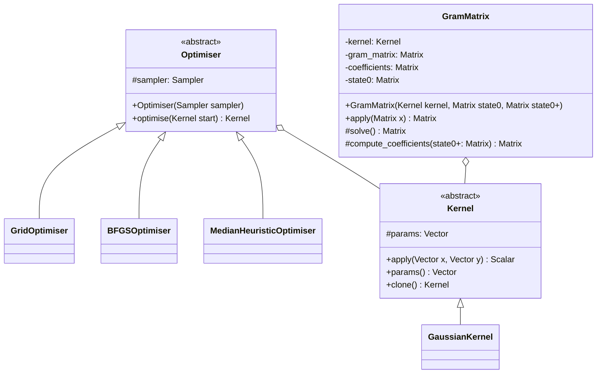
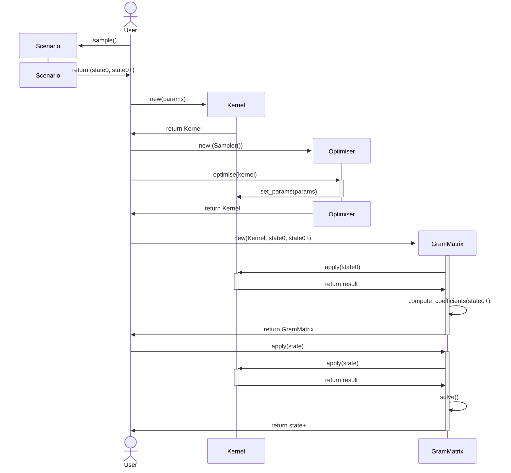

# Architecture

## UML

```mermaid
classDiagram
    class Optimiser {
        <<abstract>>
        #sampler: Sampler
        +Optimiser(Sampler sampler)
        +optimise(Kernel start) Kernel
    }
    class GridOptimiser
    class BFGSOptimiser
    class MedianHeuristicOptimiser

    class Kernel {
        <<abstract>>
        #params: Vector
        +apply(Vector x, Vector y) Scalar
        +params() Vector
        +clone() Kernel
    }
    class GaussianKernel

    class GramMatrix {
        +GramMatrix(Kernel kernel, Matrix state0, Matrix state0+)
        -kernel: Kernel
        -gram_matrix: Matrix
        -coefficients: Matrix
        -state0: Matrix
        +apply(Matrix x) Matrix
        #solve() Matrix
        #compute_coefficients(state0+: Matrix) Matrix
    }

    Optimiser <|-- GridOptimiser
    Optimiser <|-- BFGSOptimiser
    Optimiser <|-- MedianHeuristicOptimiser

    Kernel <|-- GaussianKernel

    GramMatrix o-- Kernel
    Optimiser o-- Kernel
```

## Sequence Diagram

```mermaid
sequenceDiagram
    create participant Scenario
    actor User
    User ->> Scenario: sample()
    destroy Scenario
    Scenario ->> User: return (state0, state0+)
    create participant Kernel
    User ->> Kernel: new(params)
    Kernel ->> User: return Kernel
    create participant Optimiser
    User ->> Optimiser: new (Sampler())
    User ->>+ Optimiser: optimise(kernel)
    Optimiser ->> Kernel: set_params(params)
    deactivate Optimiser
    destroy Optimiser
    Optimiser ->> User: return Kernel
    Create participant GramMatrix
    User ->>+ GramMatrix: new(Kernel, state0, state0+)
    GramMatrix ->>+ Kernel: apply(state0)
    Kernel ->>- GramMatrix: return result
    GramMatrix ->> GramMatrix: compute_coefficients(state0+)
    GramMatrix ->>- User: return GramMatrix
    User ->>+ GramMatrix: apply(state)
    GramMatrix ->>+ Kernel: apply(state)
    Kernel ->>- GramMatrix: return result
    GramMatrix ->> GramMatrix: solve()
    GramMatrix ->>- User: return state+
```
