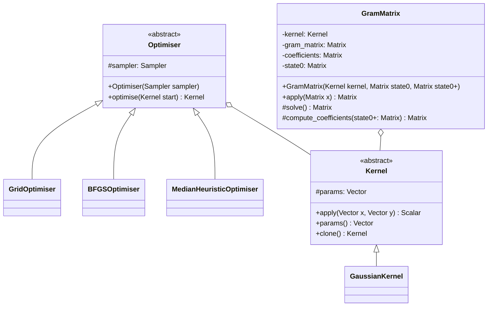
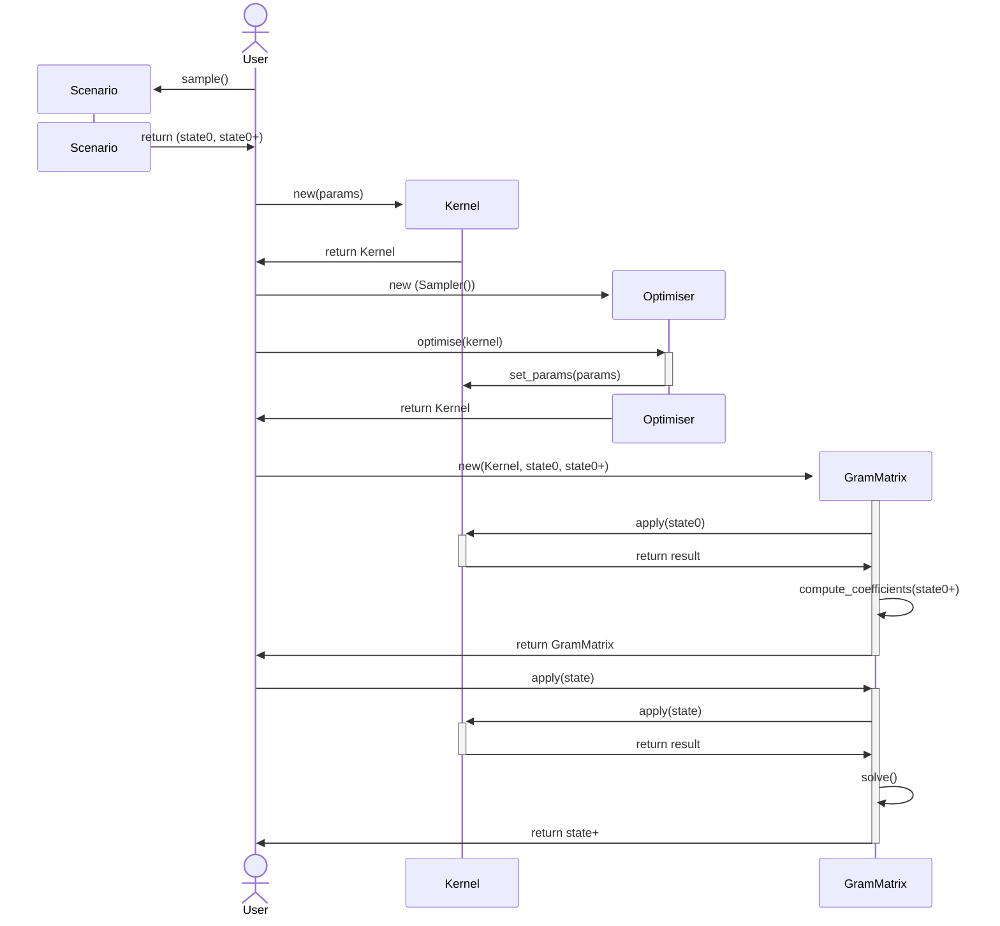
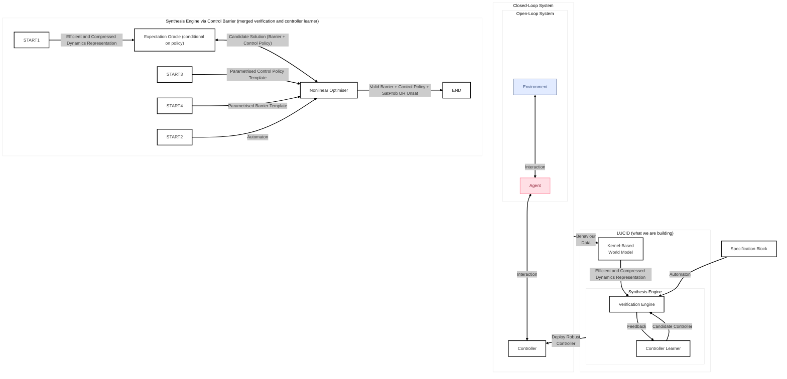

# Architecture

## UML

```mermaid
classDiagram
    class Optimiser {
        <<abstract>>
        #sampler: Sampler
        +Optimiser(Sampler sampler)
        +optimise(Kernel start) Kernel
    }
    class GridOptimiser
    class BFGSOptimiser
    class MedianHeuristicOptimiser

    class Kernel {
        <<abstract>>
        #params: Vector
        +apply(Vector x, Vector y) Scalar
        +params() Vector
        +clone() Kernel
    }
    class GaussianKernel

    class GramMatrix {
        +GramMatrix(Kernel kernel, Matrix state0, Matrix state0+)
        -kernel: Kernel
        -gram_matrix: Matrix
        -coefficients: Matrix
        -state0: Matrix
        +apply(Matrix x) Matrix
        #solve() Matrix
        #compute_coefficients(state0+: Matrix) Matrix
    }

    Optimiser <|-- GridOptimiser
    Optimiser <|-- BFGSOptimiser
    Optimiser <|-- MedianHeuristicOptimiser

    Kernel <|-- GaussianKernel

    GramMatrix o-- Kernel
    Optimiser o-- Kernel
```

## Sequence Diagram

```mermaid
sequenceDiagram
    create participant Scenario
    actor User
    User ->> Scenario: sample()
    destroy Scenario
    Scenario ->> User: return (state0, state0+)
    create participant Kernel
    User ->> Kernel: new(params)
    Kernel ->> User: return Kernel
    create participant Optimiser
    User ->> Optimiser: new (Sampler())
    User ->>+ Optimiser: optimise(kernel)
    Optimiser ->> Kernel: set_params(params)
    deactivate Optimiser
    destroy Optimiser
    Optimiser ->> User: return Kernel
    Create participant GramMatrix
    User ->>+ GramMatrix: new(Kernel, state0, state0+)
    GramMatrix ->>+ Kernel: apply(state0)
    Kernel ->>- GramMatrix: return result
    GramMatrix ->> GramMatrix: compute_coefficients(state0+)
    GramMatrix ->>- User: return GramMatrix
    User ->>+ GramMatrix: apply(state)
    GramMatrix ->>+ Kernel: apply(state)
    Kernel ->>- GramMatrix: return result
    GramMatrix ->> GramMatrix: solve()
    GramMatrix ->>- User: return state+
```

## Idea

```mermaid
---
config:
  layout: dagre
  theme: neo
---
flowchart TD
 subgraph Dyn["Open-Loop System"]
        A["Agent"]
        Env["Environment"]
  end
 subgraph Sys["Closed-Loop System"]
        Dyn
        C["Controller"]
  end
 subgraph lucid["LUCID (what we are building)"]
        WM["Kernel-Based <br> World Model"]
        Syn["Syn"]
  end
 subgraph Syn["Synthesis Engine"]
        Ver["Verification Engine"]
        RL["Controller Learner"]
  end
    Sys -- Behaviour <br> Data --> WM
    C <-- Interaction --> A
    Env <-- Interaction --> A
    WM -- Efficient and Compressed Dynamics Representation --> Ver
    RL -- Candidate Controller --> Ver
    Syn -- "Deploy Robust <br> Controller" --> C
    Ver -- Feedback --> RL
    Spec["Specification Block"] -- Automaton --> Ver
    A["Agent"]
    Env["Environment"]
     A:::Rose
     Env:::Sky
    classDef Rose stroke-width:1px, stroke-dasharray:none, stroke:#FF5978, fill:#FFDFE5, color:#8E2236
    classDef Sky stroke-width:1px, stroke-dasharray:none, stroke:#374D7C, fill:#E2EBFF, color:#374D7C

subgraph V["Synthesis Engine via Control Barrier (merged verification and controller learner)"]
    START1:::hidden -- Efficient and Compressed Dynamics Representation --> EO
    EO["Expectation Oracle (conditional on policy)"] <-- Candidate Solution (Barrier + Control Policy) --> Opt
    START3:::hidden -- Parametrised Control Policy Template --> Opt
    START4:::hidden -- Parametrised Barrier Template --> Opt
    Opt["Nonlinear Optimiser"] -- Valid Barrier + Control Policy + SatProb OR Unsat -->END:::hidden
    START2:::hidden -- Automaton --> Opt
end
```
