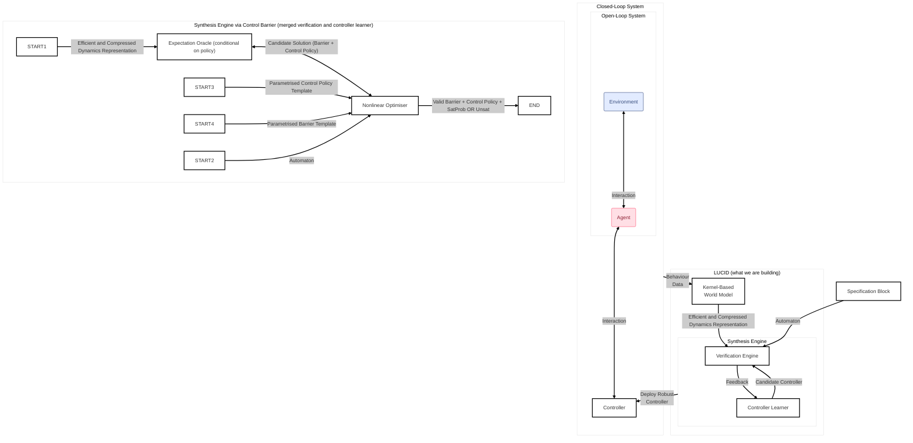

```mermaid
---
config:
  layout: dagre
  theme: neo
---
flowchart TD
 subgraph Dyn["Open-Loop System"]
        A["Agent"]
        Env["Environment"]
  end
 subgraph Sys["Closed-Loop System"]
        Dyn
        C["Controller"]
  end
 subgraph lucid["LUCID (what we are building)"]
        WM["Kernel-Based <br> World Model"]
        Syn["Syn"]
  end
 subgraph Syn["Synthesis Engine"]
        Ver["Verification Engine"]
        RL["Controller Learner"]
  end
    Sys -- Behaviour <br> Data --> WM
    C <-- Interaction --> A
    Env <-- Interaction --> A
    WM -- Efficient and Compressed Dynamics Representation --> Ver
    RL -- Candidate Controller --> Ver
    Syn -- "Deploy Robust <br> Controller" --> C
    Ver -- Feedback --> RL
    Spec["Specification Block"] -- Automaton --> Ver
    A@{ shape: rounded}
    Env@{ shape: rounded}
     A:::Rose
     Env:::Sky
    classDef Rose stroke-width:1px, stroke-dasharray:none, stroke:#FF5978, fill:#FFDFE5, color:#8E2236
    classDef Sky stroke-width:1px, stroke-dasharray:none, stroke:#374D7C, fill:#E2EBFF, color:#374D7C

subgraph V["Synthesis Engine via Control Barrier (merged verification and controller learner)"]
    START1:::hidden -- Efficient and Compressed Dynamics Representation --> EO
    EO["Expectation Oracle (conditional on policy)"] <-- Candidate Solution (Barrier + Control Policy) --> Opt
    START3:::hidden -- Parametrised Control Policy Template --> Opt
    START4:::hidden -- Parametrised Barrier Template --> Opt
    Opt["Nonlinear Optimiser"] -- Valid Barrier + Control Policy + SatProb OR Unsat -->END:::hidden
    START2:::hidden -- Automaton --> Opt
end
```
