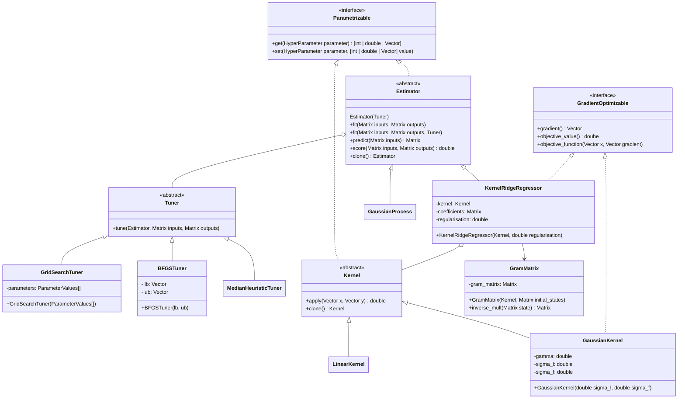
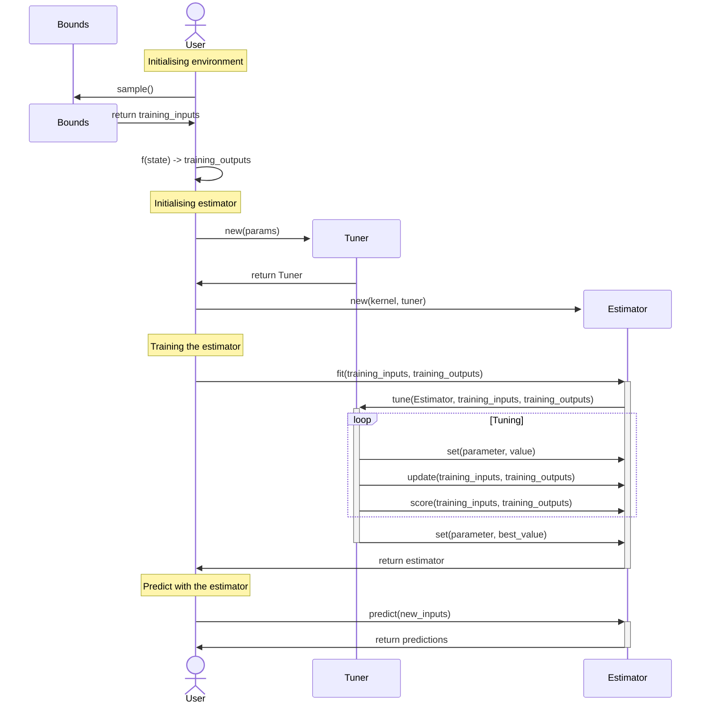
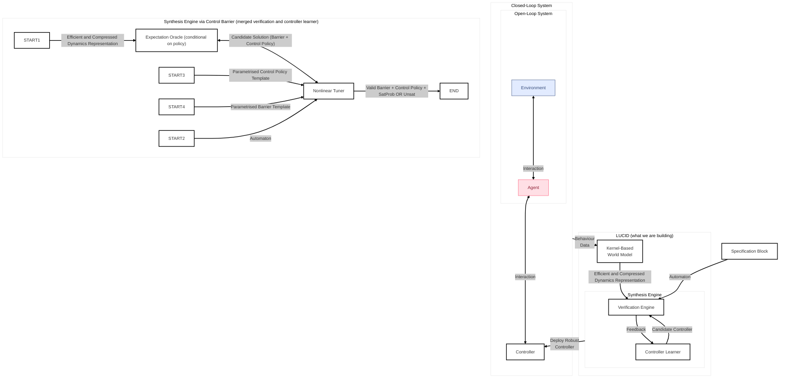

# Design

## UML

## LP dependency graph

```mermaid
flowchart TD
  X("$$\mathcal{X}$$")
  Xu("$$\mathcal{X}_u$$")
  X0("$$\mathcal{X}_0$$")
  XsX("$$\mathcal{\tilde{X}} \setminus \mathcal{X}$$")
  XsX0("$$\mathcal{\tilde{X}} \setminus \mathcal{X}_0$$")
  XsXu("$$\mathcal{\tilde{X}} \setminus \mathcal{X}_u$$")
  D("$$\phi(\mathcal{\tilde{Xp}}) - \phi(\mathcal{\tilde{X}})$$")
  DXsX("$$\phi(\mathcal{\tilde{Xp}} \setminus \mathcal{X}) - \phi(\mathcal{\tilde{X}} \setminus \mathcal{X})$$")
  BminX0("$$\min_{x \in \mathcal{X}_0} \phi(x)^T b $$")
  BmaxXu("$$\max_{x \in \mathcal{X}_u} \phi(x)^T b $$")
  BmaxX("$$\max_{x \in \mathcal{X}} \phi(x)^T b $$")
  BdminX("$$\max_{x \in \mathcal{X}} \phi(x)^T (Hb - b) $$")
  BminXsX("$$\min_{x \in \mathcal{\tilde{X}} \setminus \mathcal{X}} \phi(x)^T b $$")
  BmaxXsX("$$\max_{x \in \mathcal{\tilde{X}} \setminus \mathcal{X}} \phi(x)^T b $$")
  BminXsX0("$$\min_{x \in \mathcal{\tilde{X}} \setminus \mathcal{X}_0} \phi(x)^T b $$")
  BmaxXsX0("$$\max_{x \in \mathcal{\tilde{X}} \setminus \mathcal{X}_0} \phi(x)^T b $$")
  BminXsXu("$$\min_{x \in \mathcal{\tilde{X}} \setminus \mathcal{X}_u} \phi(x)^T b $$")
  BmaxXsXu("$$\max_{x \in \mathcal{\tilde{X}} \setminus \mathcal{X}_u} \phi(x)^T b $$")
  BdminsX("$$\min_{x \in \mathcal{\tilde{X}} \setminus \mathcal{X}} \phi(x)^T (Hb - b) $$")
  BdmaxsX("$$\max_{x \in \mathcal{\tilde{X}} \setminus \mathcal{X}} \phi(x)^T (Hb - b) $$")
  Asx0("$$A^{S \setminus X_0}_{\tilde{N}}$$")
  Asxu("$$A^{S \setminus X_u}_{\tilde{N}}$$")
  Asx("$$A^{S \setminus X}_{\tilde{N}}$$")
  C("$$\left(1 - \frac{2 f_{max}}{\tilde{Q}}\right)^{-n/2}$$")

  hateta("$$\hat{\eta}$$")
  hatgamma("$$\hat{\gamma}$$")
  hatdelta("$$\hat{\Delta}$$")
  hatxi("$$\hat{\xi}$$")

  eta("$$\eta$$")
  gamma("$$\gamma$$")
  delta("$$c - \varepsilon \bar{B} \kappa$$")

  XsX --> BminXsX
  XsX --> BmaxXsX
  XsX --> Asx
  XsX0 --> BminXsX0
  XsX0 --> BmaxXsX0
  XsX0 --> Asx0
  XsXu --> BminXsXu
  XsXu --> BmaxXsXu
  XsXu --> Asxu

  X0 --> BminX0
  Xu --> BmaxXu
  X --> BmaxX
  D --> BdminX
  DXsX --> BdminsX
  DXsX --> BdmaxsX

  C --> hateta
  eta --> hateta
  Asx0 --> hateta
  BminX0 --> hateta
  BminXsX0 --> hateta
  BmaxXsX0 --> hateta

  C --> hatgamma
  gamma --> hatgamma
  Asxu --> hatgamma
  BmaxXu --> hatgamma
  BminXsXu --> hatgamma
  BmaxXsXu --> hatgamma


  C --> hatdelta
  delta --> hatdelta
  Asx --> hatdelta
  BdminX --> hatdelta
  BdminsX --> hatdelta
  BdmaxsX --> hatdelta

  C --> hatxi
  Asx --> hatxi
  BmaxX --> hatxi
  BminXsX --> hatxi
  BmaxXsX --> hatxi
```

Where:

- $\mathcal{X} \subseteq \mathbb{R}^{n}$: State space we are interested in modeling.
- $\mathcal{X}_0 \subseteq \mathcal{X}$: Initial subset of the state space.
- $\mathcal{X}_u \subseteq \mathcal{X}$: Unsafe subset of the state space.
- $\phi : [0, 1]^n \to \mathbb{R}^{2m+1}$ Truncated Fourier feature map.
    - $\phi(x) = \begin{bmatrix} w_0 &  \sqrt{2} w_1\cos(\omega_1^T P(x)) & \sqrt{2} w_1 \sin(\omega_1^T P(x)) & \dots & \sqrt{2} w_m\cos(\omega_m^T P(x)) & \sqrt{2} w_m \sin(\omega_m^T P(x)) \end{bmatrix}^T$ where $P$ is simply a map from $\mathcal{X}$ to $[0, 1]^n$.
- $\mathcal{\tilde{X}} \subseteq \mathbb{R}^n$: State space with the property of being the smallest subset of $\mathbb{R}^n$ on which $\phi$ is periodic. 
- $b \in \mathbb{R}^{2m+1}$ Weight vector. It contains the decision variables of the LP.
- $K \in \mathbb{R}^{(2m+1) \times(2m+1)}$ Gram matrix. It is computed as $K_{ij} = \sum_{k=1}^{n} \phi_i(x_k) \phi_j(x_k)$, where $x_k$ are the training samples.

## Sequence Diagram

## Idea

