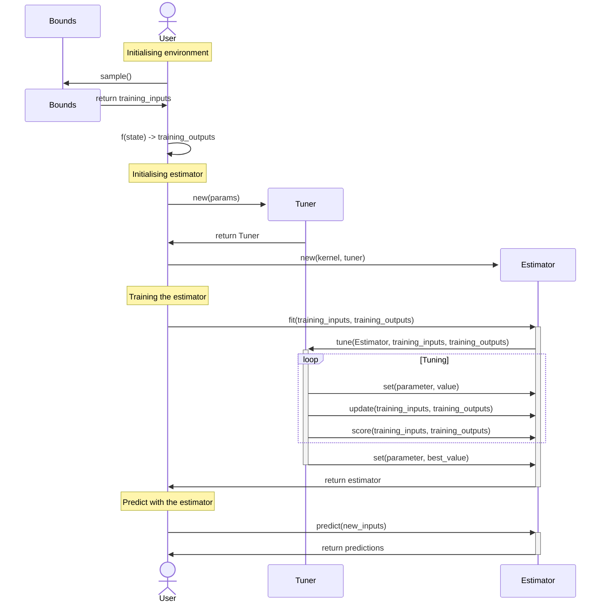
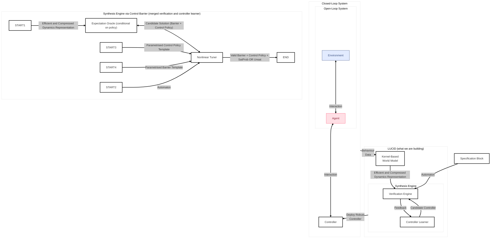

# Design

## UML

```mermaid
---
  config:
    class:
      hideEmptyMembersBox: true
---
classDiagram
    class Tuner {
        <<abstract>>
        +tune(Estimator, Matrix inputs, Matrix outputs)
    }
    class GridSearchTuner {
        -parameters: ParameterValues[]
        +GridSearchTuner(ParameterValues[])
    }
    class BFGSTuner {
        - lb: Vector
        - ub: Vector
        +BFGSTuner(lb, ub)
    }
    class MedianHeuristicTuner {
    }

    class Parametrizable {
        <<interface>>
        +get(HyperParameter parameter) [int | double | Vector]
        +set(HyperParameter parameter, [int | double | Vector] value)
    }
    class GradientOptimizable {
        <<interface>>
        +gradient() Vector
        +objective_value() doube
        +objective_function(Vector x, Vector gradient)
    }
    class Estimator {
        <<abstract>>
        Estimator(Tuner)
        +fit(Matrix inputs, Matrix outputs)
        +fit(Matrix inputs, Matrix outputs, Tuner)
        +predict(Matrix inputs) Matrix
        +score(Matrix inputs, Matrix outputs) double
        +clone() Estimator
    }
    class KernelRidgeRegressor {
        -kernel: Kernel
        -coefficients: Matrix
        -regularisation: double
        +KernelRidgeRegressor(Kernel, double regularisation)
    }
    class GaussianProcess

    class Kernel {
        <<abstract>>
        +apply(Vector x, Vector y) double
        +clone() Kernel
    }
    class GaussianKernel {
        -gamma: double
        -sigma_l: double
        -sigma_f: double
        +GaussianKernel(double sigma_l, double sigma_f)
    }
    class LinearKernel

    class GramMatrix {
        -gram_matrix: Matrix
        +GramMatrix(Kernel, Matrix initial_states)
        +inverse_mult(Matrix state) Matrix
    }

    Tuner <|-- GridSearchTuner
    Tuner <|-- BFGSTuner
    Tuner <|-- MedianHeuristicTuner
    Estimator o-- Tuner

    Parametrizable <|.. Kernel
    Parametrizable <|.. Estimator

    Estimator <|-- GaussianProcess
    Estimator <|-- KernelRidgeRegressor


    Kernel <|-- LinearKernel
    Kernel <|-- GaussianKernel

    GradientOptimizable <|.. KernelRidgeRegressor
    GradientOptimizable <|.. GaussianKernel
    KernelRidgeRegressor --> GramMatrix
    KernelRidgeRegressor o-- Kernel

```

## Sequence Diagram

```mermaid
sequenceDiagram
    create participant Bounds
    actor User

    Note over User: Initialising environment
    User ->> Bounds: sample()
    destroy Bounds
    Bounds ->> User: return training_inputs
    User ->> User: f(state) -> training_outputs

    Note over User: Initialising estimator
    create participant Tuner
    User ->> Tuner: new(params)
    Tuner ->> User: return Tuner
    create participant Estimator
    User ->> Estimator: new(kernel, tuner)

    Note over User: Training the estimator
    User ->>+ Estimator: fit(training_inputs, training_outputs)
    Estimator ->>+ Tuner: tune(Estimator, training_inputs, training_outputs)
    loop Tuning
        Tuner ->> Estimator: set(parameter, value)
        Tuner ->> Estimator: update(training_inputs, training_outputs)
        Tuner ->> Estimator: score(training_inputs, training_outputs)
    end
    Tuner ->>- Estimator: set(parameter, best_value)
    Estimator ->>- User: return estimator

    Note over User: Predict with the estimator
    User ->>+ Estimator: predict(new_inputs)
    Estimator ->>- User: return predictions
```

## Idea

```mermaid
---
config:
  layout: dagre
  theme: neo
---
flowchart TD
 subgraph Dyn["Open-Loop System"]
        A["Agent"]
        Env["Environment"]
  end
 subgraph Sys["Closed-Loop System"]
        Dyn
        C["Controller"]
  end
 subgraph lucid["LUCID (what we are building)"]
        WM["Kernel-Based <br> World Model"]
        Syn["Syn"]
  end
 subgraph Syn["Synthesis Engine"]
        Ver["Verification Engine"]
        RL["Controller Learner"]
  end
    Sys -- Behaviour <br> Data --> WM
    C <-- Interaction --> A
    Env <-- Interaction --> A
    WM -- Efficient and Compressed Dynamics Representation --> Ver
    RL -- Candidate Controller --> Ver
    Syn -- "Deploy Robust <br> Controller" --> C
    Ver -- Feedback --> RL
    Spec["Specification Block"] -- Automaton --> Ver
    A["Agent"]
    Env["Environment"]
     A:::Rose
     Env:::Sky
    classDef Rose stroke-width:1px, stroke-dasharray:none, stroke:#FF5978, fill:#FFDFE5, color:#8E2236
    classDef Sky stroke-width:1px, stroke-dasharray:none, stroke:#374D7C, fill:#E2EBFF, color:#374D7C

subgraph V["Synthesis Engine via Control Barrier (merged verification and controller learner)"]
    START1:::hidden -- Efficient and Compressed Dynamics Representation --> EO
    EO["Expectation Oracle (conditional on policy)"] <-- Candidate Solution (Barrier + Control Policy) --> Opt
    START3:::hidden -- Parametrised Control Policy Template --> Opt
    START4:::hidden -- Parametrised Barrier Template --> Opt
    Opt["Nonlinear Tuner"] -- Valid Barrier + Control Policy + SatProb OR Unsat -->END:::hidden
    START2:::hidden -- Automaton --> Opt
end
```
