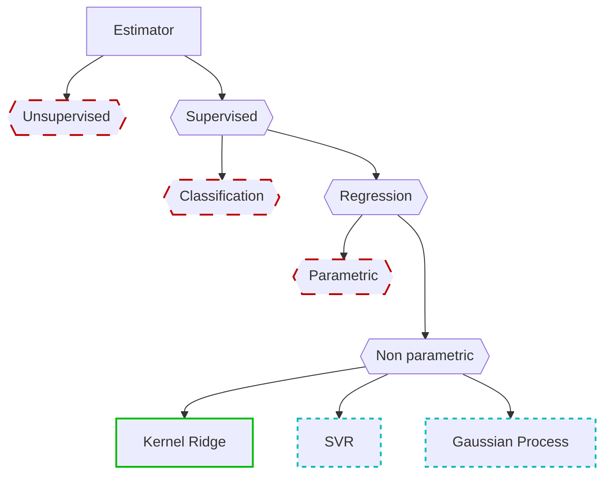

# Features

This section describes briefly the features supported by Lucid.

## Legend

The color legend below describes the status of each feature in the library.

## Estimators

### Definitions

- **Unsupervised**: Estimators that do not require labeled data for training.
- **Supervised**: Estimators that require labeled data for training.
- **Classification**: Estimators that predict discrete labels or categories.
- **Regression**: Estimators that predict continuous values.

### Formulae

#### Kernel Ridge

A regression technique that combines ridge regression with kernel methods.

##### Loss Function

$$
\ell(w) = \frac{1}{2} \|Y - w^T\Phi(X)\|^2_2 + \frac{1}{2} \lambda n \|w\|^2_2
$$

where:

- $Y$ is the target vector,
- $X$ is the input data,
- $\Phi(X)$ is the feature map over the input data,
- $w$ is the weight vector we want to learn,
- $\lambda$ is the regularization parameter,
- $n$ is the number of samples.

To obtain the optimal weights, we solve the following equation:

$$
w = \Phi(X)(\Phi(X)^T\Phi(X) + \lambda n I)^{-1}Y
$$

##### Prediction

To predict a new output $\hat{y}$ for a new input $x$, we use the following formula:

$$
\hat{y} = w^T \Phi(x) = y(\Phi(X)^T\Phi(X) + \lambda n I)^{-1}\Phi(x)^T\Phi(X) = y(K + \lambda n I)^{-1}\kappa(x)
$$

where $K$ is the Gram matrix computed from the training data, and $\kappa(x)$ is the kernel function applied to the new input $x$ against all training inputs.

## Supported Kernels

