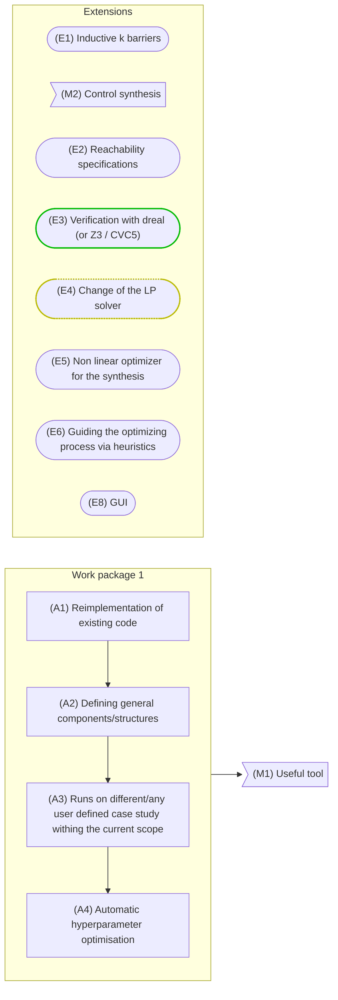

# To do

## Graphical overview

## Work package 1

### Activity 1

- [x] Complete initial implementation reproducing the results of the paper for the first test case
- [x] Rename variables
- [x] Fix current implementation correctness with integration testing
- [x] Implement second test case
- [x] Implement a proper fftn
- [x] Check whether it is possible to avoid the padding to get the same information
- [x] Implement the padding
- [x] Handle permutations
- [x] Eagerly update the permutation in the tensor

### Activity 2

- [ ] Add splitter (division of X and Y into training and validation sets)
- [x] Add scorer (how to evaluate the performance of the model)

### Activity 3

- [ ] Run Automated Anaesthesia
- [ ] Run Building Automation System

### Activity 4

- [x] Median Heuristic tuner
- [x] Grid search tuner
- [x] LBFGS tuner
- [x] Parallelise the hyperparameter optimisation (grid search)

## Extensions

### Extension 3

- [x] Add support for dReal

### Extension 4

- [x] Add support ALGLIB
- [ ] Add support HiGHS

### Extension 8

- [ ] Parse the arithmetic expressions
- [ ] Create Flask server
- [ ] Create HTML interface

## Miscellaneous

## Adding new features

- [ ] Centralised seed setting

### Performance

- [ ] Use templates instead of polymorphism where possible
- [ ] Parallelization via OpenMP and/or GPU

### Documentation

- [ ] Add docstrings to all functions

### Distribution

- [ ] Publish the package to PyPI with a wheel for Linux, Windows and MacOS

## Notes

- Expectation oracle: given a set of pairs (input, output), produce an oracle such
  that $\mathbb{E}_{x^+\approx\bar{t}(\cdot|x,u)}[\cdot(x^+)] = y$ for all pairs $(x,y)$

## Tests

- [ ] Use the LP in a white-box environment to check whether it can produce the barriers
- [x] Feature map visualisation
- [x] Add fill_area of tolerance over the barrier
- [x] Plot f_det vs estimator
- [ ] Write down formulas on overleaf
