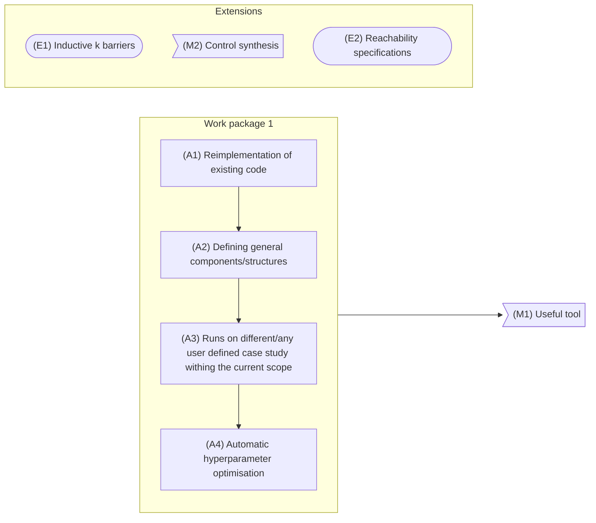

# To do

## Work package 1

### Activity 1

- [x] Complete initial implementation reproducing the results of the paper for the first test case
- [x] Rename variables
- [x] Fix current implementation correctness with integration testing
- [x] Implement second test case
- [x] Implement a proper fftn
- [x] Check whether it is possible to avoid the padding to get the same information
    - If it is, implement the alternative
    - [x] Otherwise, implement the padding
- [x] Handle permutations
- [x] Keep track of permutations
    - Is it better to do a lazy permutation, carrying the updated strides and axes (and dims?)
    - [x] Or just eagerly update the data structure?

### Activity 2

## Notes

- Expectation oracle: given a set of pairs (input, output), produce an oracle such that $\mathbb{E}_{x^+\approx\bar{t}(\cdot|x,u)}[\cdot(x^+)] = y$ for all pairs $(x,y)$